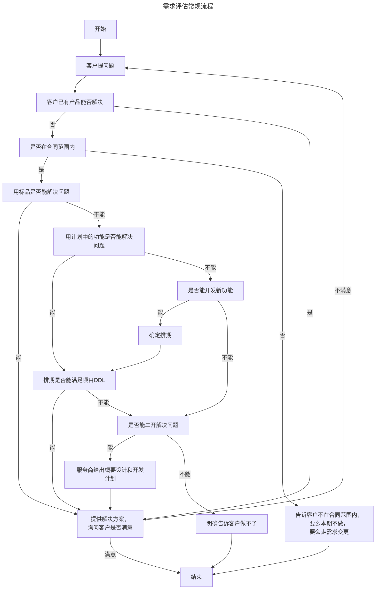

+++
title = "需求评估流程"
date = 2024-05-30T20:53:58+08:00
tags = ["需求评估","需求","评估"]
categories = ["work"]
draft = false
+++

mermaid代码如下：

```mermaid
--- 
title: 需求评估常规流程 
---

flowchart TD
开始-->a[客户提问题]
a-->b[客户已有产品能否解决]
b-->|否|id8[是否在合同范围内]
b-->|是|id7["提供解决方案，
询问客户是否满意"]
id7-->|满意|id10[结束]
id7-->|不满意|a
id8-->|是|id1[用标品是否能解决问题]
id8-->|否|id9["告诉客户不在合同范围内，
要么本期不做，
要么走需求变更"]
id9-->id10
id1-->|能|id7
id1-->|不能|id2[用计划中的功能是否能解决问题]
id2-->|能|id6[排期是否能满足项目DDL]
id6-->|能|id7
id6-->|不能|id4[是否能二开解决问题]
id2-->|不能|id3[是否能开发新功能]
id3-->|能|确定排期-->id6
id3-->|不能|id4
id4-->|能|服务商给出概要设计和开发计划-->id7
id4-->|不能|明确告诉客户做不了-->id10
```