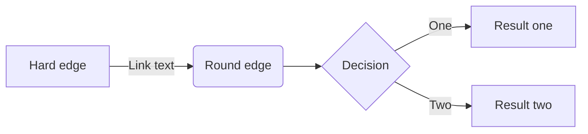
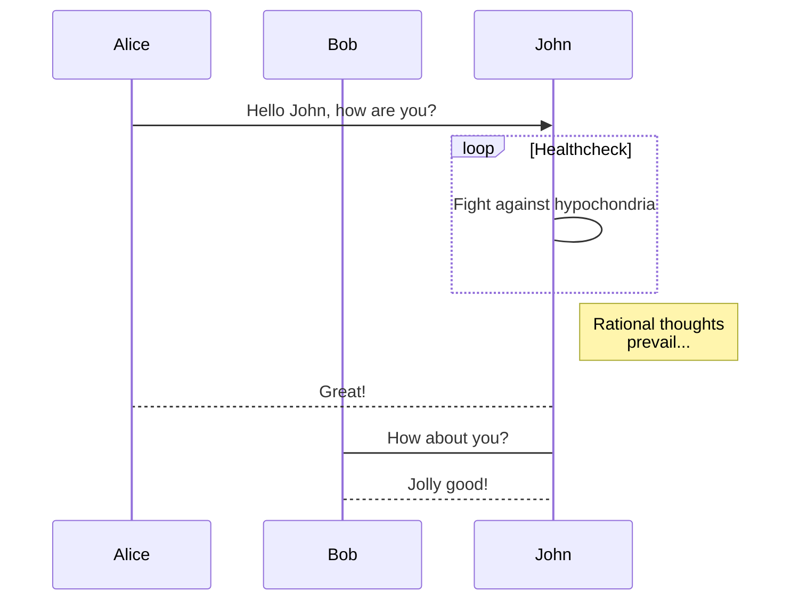
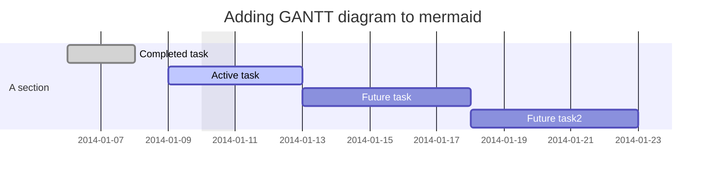
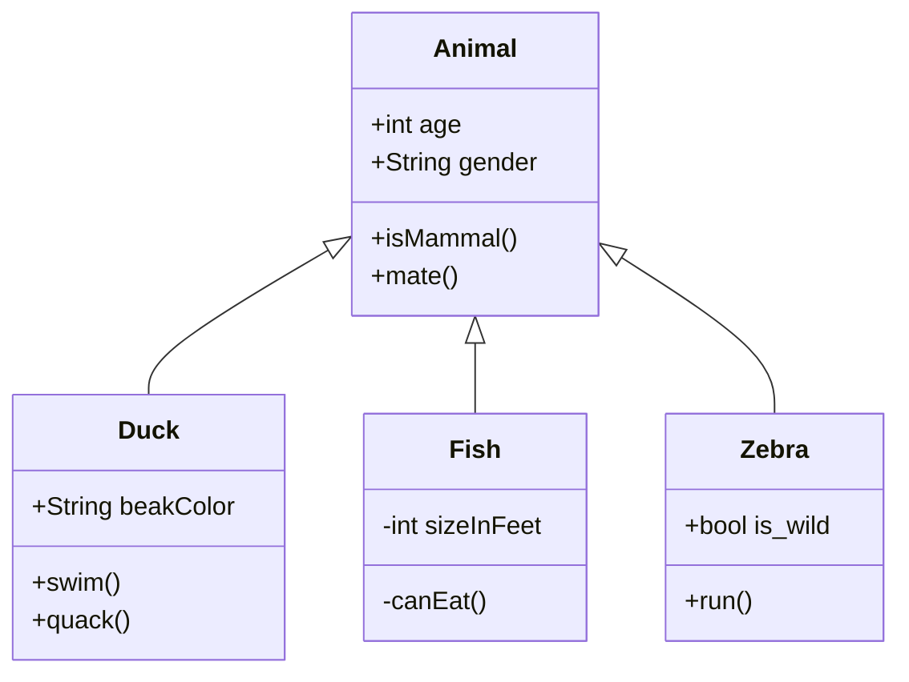
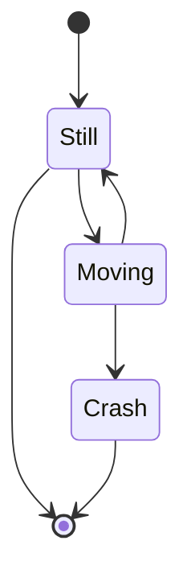
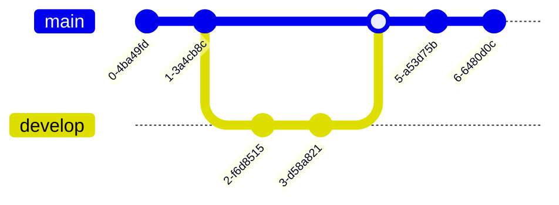
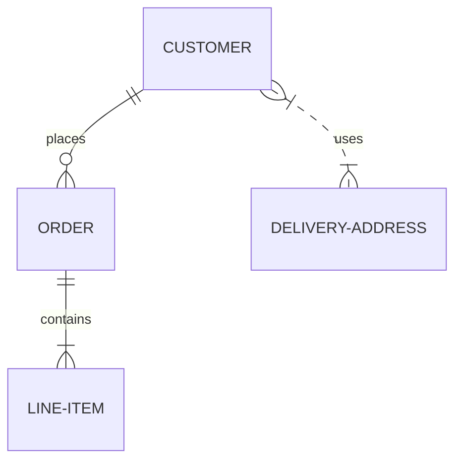
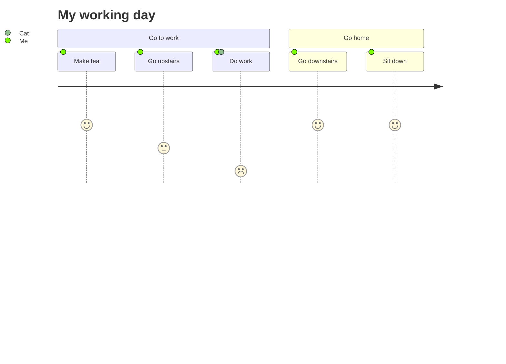
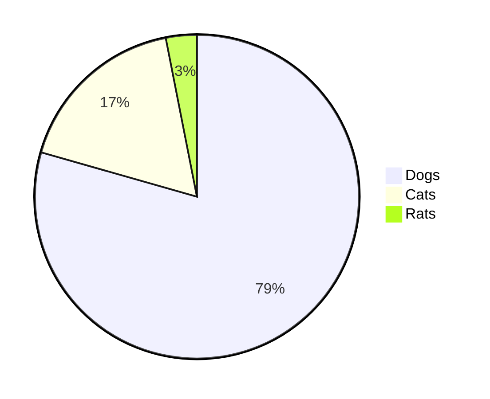
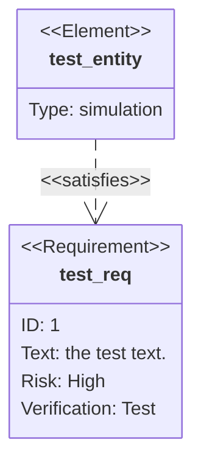

## Flowchart

```mermaid
graph LR;
    A[Hard edge] -->|Link text| B(Round edge)
    B --> C{Decision}
    C -->|One| D[Result one]
    C -->|Two| E[Result two]
```

## Sequence Digram

```mermaid
sequenceDiagram
    participant Alice
    participant Bob
    Alice->>John: Hello John, how are you?
    loop Healthcheck
        John->John: Fight against hypochondria
    end
    Note right of John: Rational thoughts <br/>prevail...
    John-->Alice: Great!
    John->Bob: How about you?
    Bob-->John: Jolly good!
```

## Gantt

```mermaid
gantt
dateFormat  YYYY-MM-DD
title Adding GANTT diagram to mermaid
excludes weekdays 2014-01-10

section A section
Completed task            :done,    des1, 2014-01-06,2014-01-08
Active task               :active,  des2, 2014-01-09, 3d
Future task               :         des3, after des2, 5d
Future task2              :         des4, after des3, 5d
```

## Class Diagram

```mermaid
classDiagram
    Animal <|-- Duck
    Animal <|-- Fish
    Animal <|-- Zebra
    Animal : +int age
    Animal : +String gender
    Animal: +isMammal()
    Animal: +mate()
    class Duck{
        +String beakColor
        +swim()
        +quack()
    }
    class Fish{
        -int sizeInFeet
        -canEat()
    }
    class Zebra{
        +bool is_wild
        +run()
    }
```

## State Diagram

```mermaid
stateDiagram-v2
    [*] --> Still
    Still --> [*]
    Still --> Moving
    Moving --> Still
    Moving --> Crash
    Crash --> [*]
```

## Git Graph

```mermaid
gitGraph
    commit
    commit
    branch develop
    checkout develop
    commit
    commit
    checkout main
    merge develop
    commit
    commit
```

## Entity Relationship Diagram

```mermaid
erDiagram
    CUSTOMER ||--o{ ORDER : places
    ORDER ||--|{ LINE-ITEM : contains
    CUSTOMER }|..|{ DELIVERY-ADDRESS : uses
```

## User Journey

```mermaid
journey
    title My working day
    section Go to work
      Make tea: 5: Me
      Go upstairs: 3: Me
      Do work: 1: Me, Cat
    section Go home
      Go downstairs: 5: Me
      Sit down: 5: Me
```

## Pie Chart

```mermaid
pie
    "Dogs" : 386
    "Cats" : 85
    "Rats" : 15
```

## Requirement Diagram

```mermaid
requirementDiagram

requirement test_req {
id: 1
text: the test text.
risk: high
verifymethod: test
}

element test_entity {
type: simulation
}

test_entity - satisfies -> test_req
```
